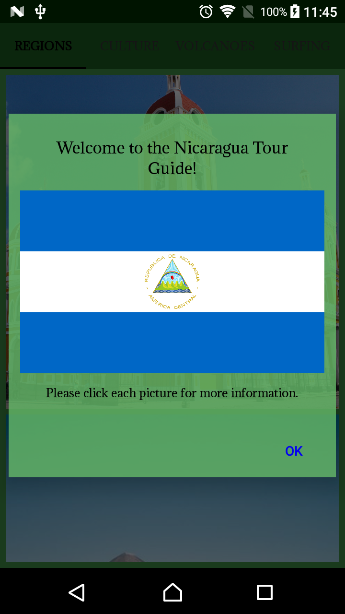
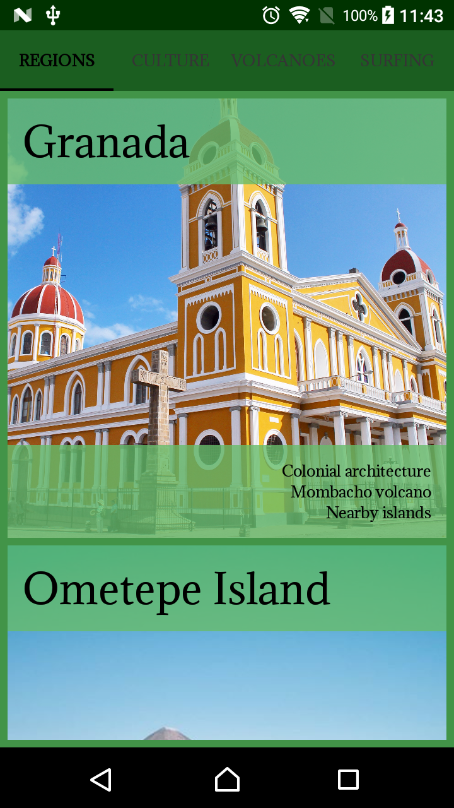
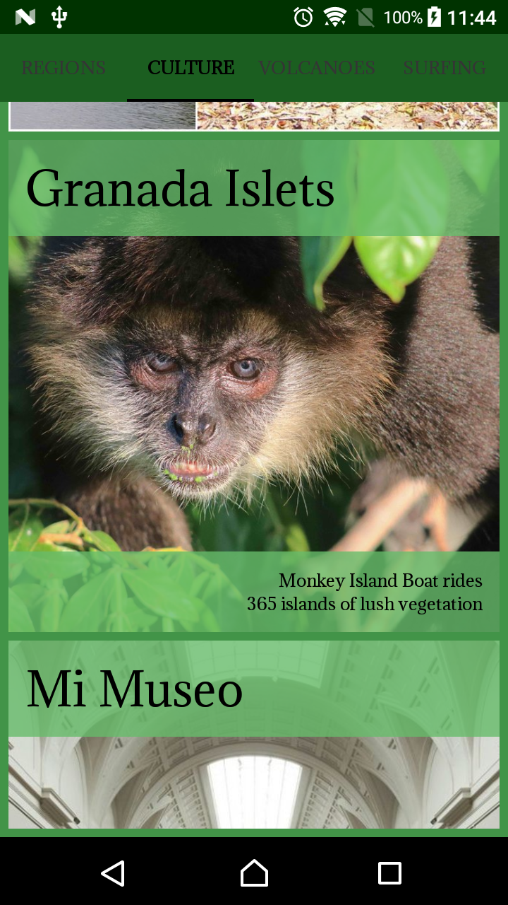

# Nicaragua - The land of lakes and volcanoes.

This is an Android app that presents relevant information to a user visiting the country of Nicaragua, created as part of the [Android Basics Nanodegree by Google](https://www.udacity.com/course/android-basics-nanodegree-by-google--nd803). The app lists regions, culture, volcanoes, and surfing locations. It contains all the best known secrets that only locals know.

### Skills Demonstrated

- Planning an app design and navigation before coding.
- Selecting proper data structures to store lists of information.
- Building layouts to display those lists of data.
- Navigating between lists in fragments using a viewpager and tablayout.
- Creating custom classes.
- Handling images using third party libraries.

#### Introduction on 720 x 1280p (API 25) in portrait orientation.
#### 

#### Item details on 720 x 1280p (API 25) in portrait orientation.
#### 
#### 
